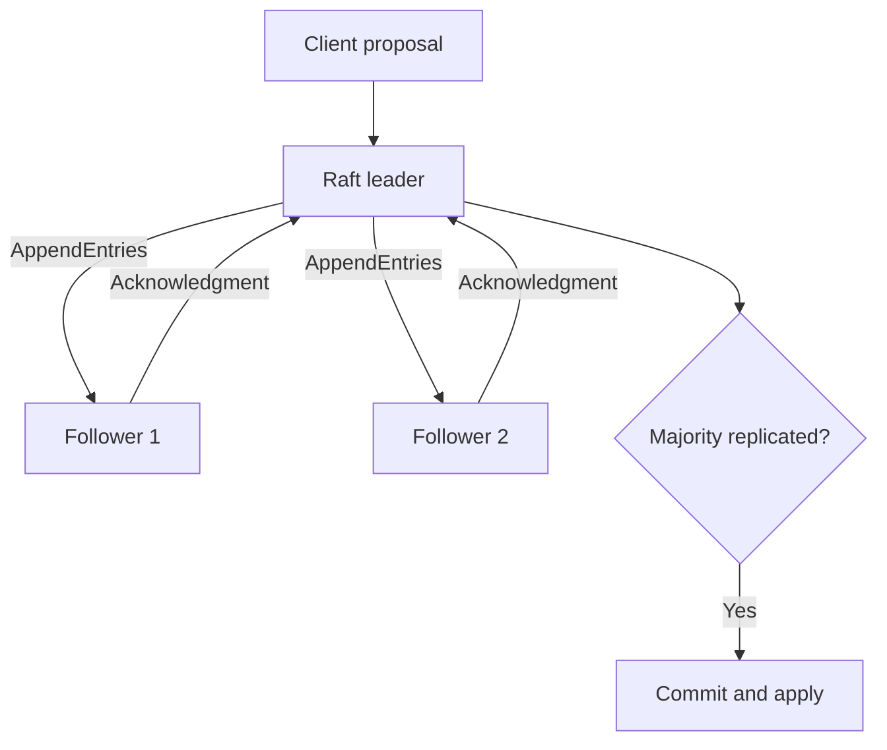

# Raft Consensus Protocol

A C++20 implementation of the [Raft consensus algorithm](https://raft.github.io/) built as a multi-stage distributed systems project at the University of Southern California. The system coordinates a cluster of independent nodes over gRPC, elects a stable leader, replicates client commands, commits entries after majority agreement, and evaluates the implementation with latency and throughput benchmarks.

## Overview

Raft allows a collection of servers to behave like a single reliable replicated state machine. Client commands are appended to a replicated log and applied in the same order on every live replica. The cluster can continue making progress while a majority of nodes remain available and able to communicate.

This project was developed in three stages:

1. **Leader election** — node state transitions, randomized election timeouts, heartbeats, voting, and leader stability under disconnections and network partitions.
2. **Log replication** — proposal handling, `AppendEntries` consistency checks, majority-based commitment, ordered application of committed entries, and recovery of lagging or divergent followers.
3. **Performance evaluation** — synchronous proposals, unloaded-latency measurement, multi-client throughput testing, percentile calculations, and comparison across different replica counts.

## Features

- Follower, candidate, and leader state transitions
- Randomized election timeouts and periodic leader heartbeats
- `RequestVote` and `AppendEntries` RPCs implemented with Protocol Buffers and gRPC
- Majority-quorum leader election and log commitment
- Thread-safe handling of concurrent proposals
- Rejection of stale terms and safe handling of delayed RPC responses
- Log consistency checks and follower catch-up after reconnection
- Simulation of node disconnections and network partitions
- Structured console and per-node file logging with `spdlog`
- Closed-loop latency and throughput benchmarks
- Average, p50, p90, and p99 latency reporting
- Performance experiments with 3-, 5-, and 11-replica clusters

## Architecture

Each Raft node runs as an independent process and communicates with its peers exclusively through gRPC.



The leader appends a proposal to its local log and sends it to followers. Once the entry is stored by a majority of the cluster, the leader advances its commit index and applies the command to the state machine. Updated commit information is then propagated to followers.

## Project Structure

```text
.
├── app/                 # Node, multi-node, latency, and throughput applications
├── bench/               # Benchmark parsing and plotting scripts
├── cmake/               # CMake helper modules
├── generated/           # Generated protobuf and gRPC sources
├── inc/
│   ├── common/          # Shared data types, utilities, and logging
│   ├── rafty/           # Raft public interface and implementation headers
│   └── toolings/        # Test and cluster-control utilities
├── integration_tests/   # Multi-process integration tests
├── libs/                # Third-party dependencies
├── proto/               # Raft RPC and message definitions
├── src/                 # Raft implementation
└── unittests/           # Unit tests
```

## Requirements

- Ubuntu Linux (the course environment used Ubuntu 22.04)
- C++20-compatible compiler (GCC 13 or newer recommended)
- CMake 3.22 or newer
- gRPC and Protocol Buffers
- Python 3 and Matplotlib for benchmark plots

## Build

Initialize the dependencies once:

```bash
./setup.sh
```

Configure and compile the project:

```bash
mkdir -p build
cd build
cmake ..
make -j"$(nproc)"
```

Build artifacts are generated under `build/`.

## Running a Cluster

### Multi-node application

From the directory containing the compiled applications, start a local three-node cluster:

```bash
./multinode --num 3
```

Supported interactive commands include:

| Command | Description |
|---|---|
| `r` | Start the Raft nodes |
| `prop <data>` | Propose a command for replication |
| `dis <node-id ...>` | Disconnect one or more nodes |
| `conn <node-id ...>` | Reconnect one or more nodes |
| `k` | Stop the cluster |

The failure mode can be selected with `--fail_type`:

- `0`: disconnected nodes cannot communicate with any peer.
- `1`: nodes on the same side of a simulated partition can communicate with each other but not across the partition.

### Individual nodes

The following example starts three nodes in separate terminals:

```bash
./node --id 0 --port 50050 --peers 1+localhost:50051,2+localhost:50052
./node --id 1 --port 50051 --peers 0+localhost:50050,2+localhost:50052
./node --id 2 --port 50052 --peers 0+localhost:50050,1+localhost:50051
```

## Testing

Run the integration test suite from the build directory:

```bash
cd build/integration_tests
./raft_test
```

The tests exercise leader election, leader stability, proposals, log agreement, quorum behavior, concurrency, and recovery from simulated network failures.

## Benchmarking

### Unloaded latency

The latency benchmark uses a closed-loop client to submit 1,000 synchronous proposals and reports average, median (p50), and p99 latency:

```bash
./latency
```

### Multi-client throughput

The throughput benchmark runs multiple rounds, doubling the number of concurrent clients up to the supplied maximum. Each client submits 1,000 synchronous proposals:

```bash
./tput <max-client-count>
```

Results include client count, average latency, p50, p90, p99, and committed operations per second. The plotting script under `bench/` can be used to visualize the latency-throughput relationship and compare clusters with different replica counts.

## Correctness Properties

The implementation is designed around the core Raft guarantees:

- **Election safety:** at most one leader is elected in a given term.
- **Leader append-only:** a leader never overwrites or deletes entries in its own log.
- **Log matching:** matching entries imply identical preceding log history.
- **Leader completeness:** committed entries appear in the logs of future leaders.
- **State-machine safety:** nodes do not apply different commands at the same log index.

Without a majority quorum, the system preserves safety but cannot commit new commands. Progress resumes when a majority can communicate again.

## Scope and Limitations

This educational implementation focuses on leader election, in-memory log replication, fault recovery, and performance measurement. It does not implement:

- Persistent state or crash recovery from disk
- Dynamic cluster membership
- Log compaction or snapshots
- gRPC streaming

## Acknowledgments

Developed for USC's Distributed Systems course. The project structure and assignments were inspired by MIT 6.824 and the extended Raft paper:

> Diego Ongaro and John Ousterhout, “In Search of an Understandable Consensus Algorithm,” USENIX ATC 2014.

## Academic Integrity

This repository contains coursework. Keep the repository private and follow the course's collaboration and code-sharing policies.
